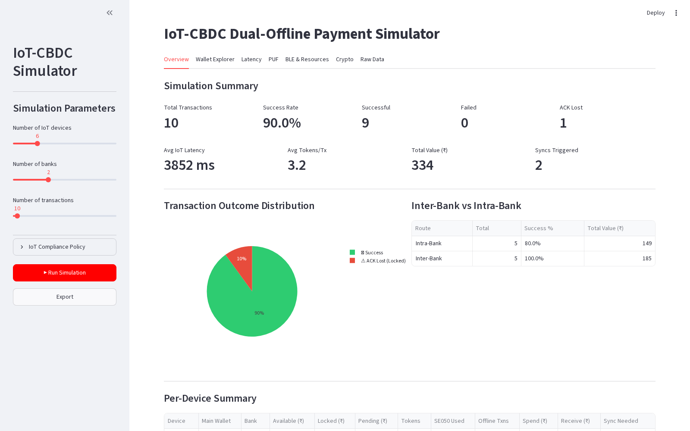
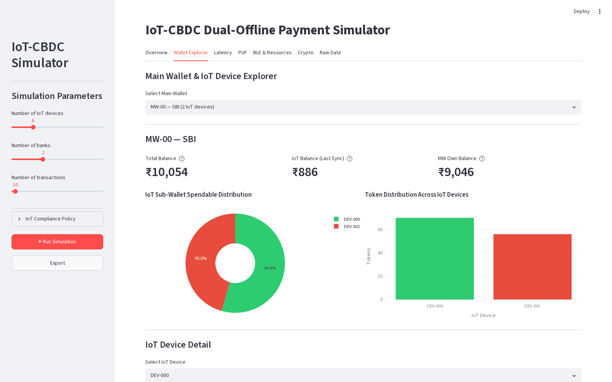
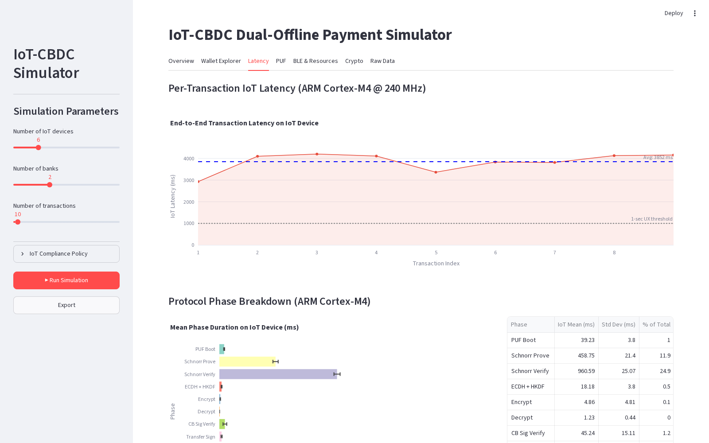
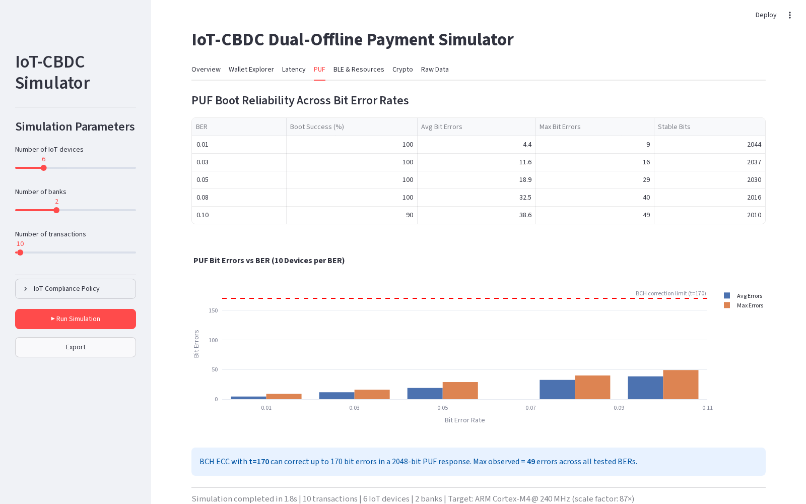
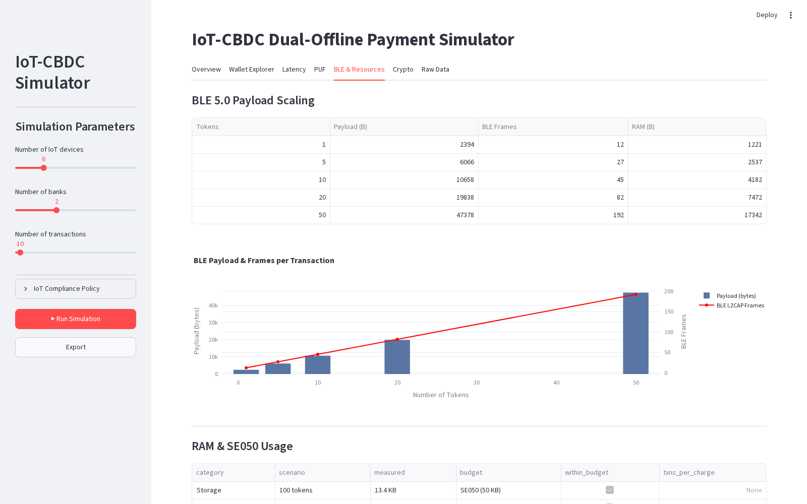
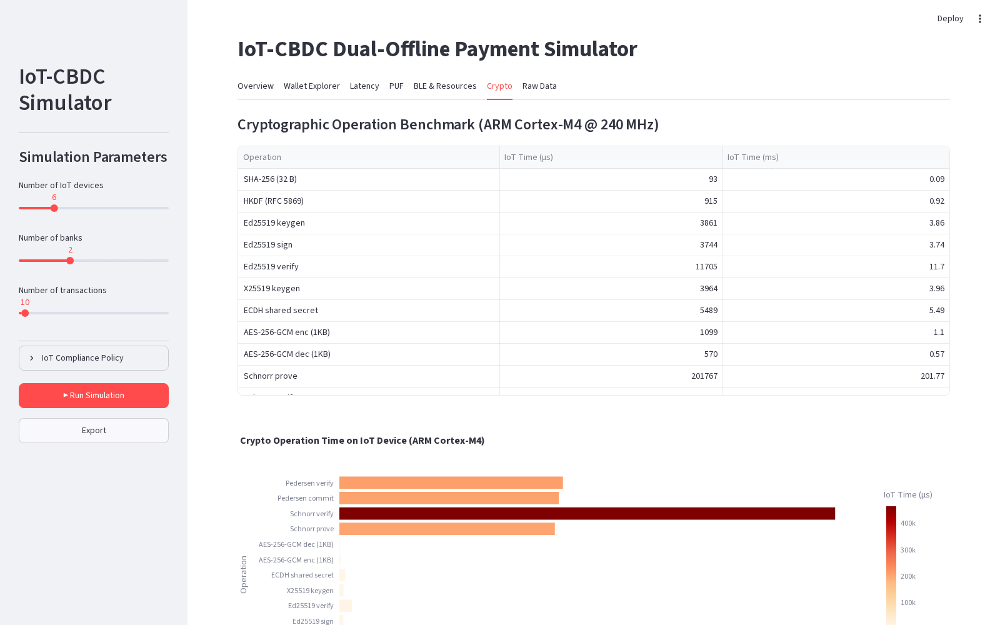
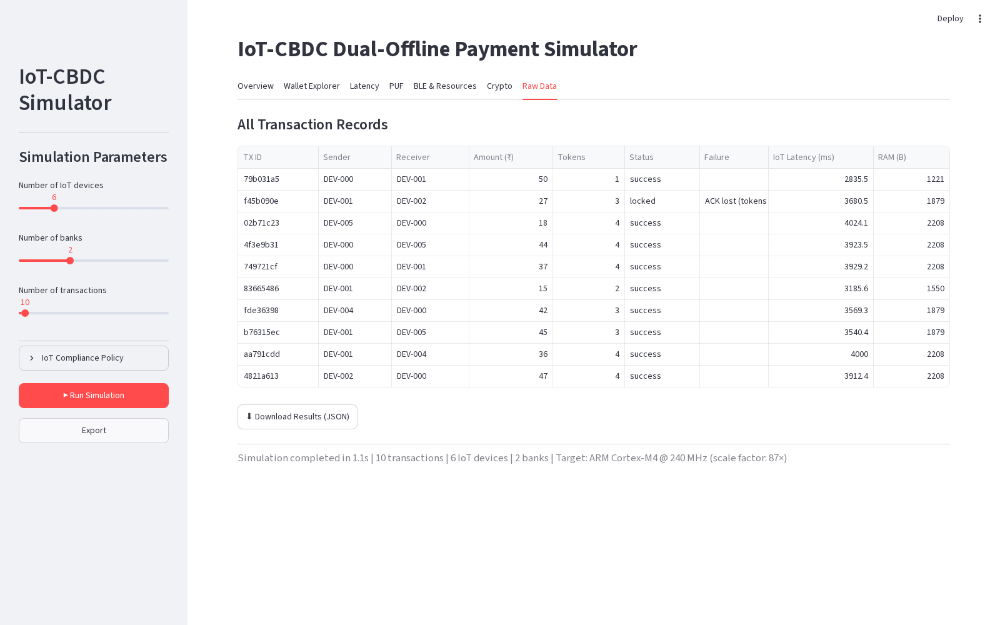

# IoT-CBDC Dual-Offline Payment Simulator

Software simulator for the paper *"ZKP and PUF-Authenticated Dual-Offline CBDC
Protocol with AML/CFT Compliance for Resource-Constrained IoT Devices."*
Since a physical ESP32 + NXP SE050 prototype was not available, the full
protocol is simulated in Python using **real cryptographic primitives**
(Curve25519/Ed25519, Schnorr NIZKP, Pedersen commitments, AES-256-GCM,
SHA-256, HKDF via the OpenSSL-backed `cryptography` library) and a
*measure-then-scale* methodology: timings are measured on the host and
projected to ARM Cortex-M4 with per-primitive scaling factors (87× for ECC,
10× for hardware-accelerated symmetric crypto, 1× for BLE air time).

## Files

| File | Purpose |
|---|---|
| `iot_sim_engine.py` | Core engine: SRAM-PUF model, dual-table token store (Unspent/Pending), 5-message BLE transaction protocol, WAL, compliance counters, sync + balance sweep, multi-seed runner |
| `dashboard.py` | Interactive Streamlit dashboard (screenshots below) |
| `figure_generator.py` | General matplotlib figure export |
| `paper_experiments.py` | One-command regeneration of the paper's result figures (fig7, fig10, fig12) + `stats.json` from the 10-seed experiment |
| `paper_figures_v2/` | Latest paper figures + multi-seed statistics (`ms.json`) |
| `docs/screenshots/` | Dashboard screenshots used in this README |

## Setup & Run

```bash
python3 -m venv .venv
source .venv/bin/activate
pip install -r requirements.txt

# Interactive dashboard
streamlit run dashboard.py

# Regenerate paper figures (10 seeds × 100 transactions)
python3 paper_experiments.py
```

## Key engine options (v2)

`SimulationConfig` in `iot_sim_engine.py`:

- `enforce_bmax_at_load` (default `True`) — bank refuses to load past the
  ₹500 `B_max` holding cap. Set `False` + `loading_strategy="random"` to
  reproduce the legacy (paper v1) stress-test run.
- `loading_strategy="balanced"` — devices receive a composable ₹500
  denomination float (1×₹100, 2×₹50, 5×₹20, 10×₹10, 10×₹5, 15×₹2, 20×₹1).
- `rebalance_at_sync` (default `True`) — the bank re-denominates the float at
  every synchronization. **This eliminates exact-change failures entirely**
  (0/1,000 vs. 20% in the uncapped legacy run).
- `run_multi_seed(config, seeds)` — statistical runs; the paper uses seeds
  42–51 (1,000 transactions total → 93.5 ± 1.7% success).
- `arm_projected_ms(tx_record)` — per-primitive ARM Cortex-M4 latency
  projection including the analytical SE050 I/O model.

---

# Dashboard Guide

> Screenshots below were captured from a headless run inside a Linux VM
> (6 devices, 2 banks, 10 transactions, seed 42). Outcome **counts** are
> seed-deterministic; absolute **timings** in the screenshots differ from the
> paper because the paper's measurements were taken on Apple Silicon and the
> dashboard's ARM column uses the legacy uniform 87× factor.

## 1. Overview



The landing tab after pressing **Run Simulation**. The sidebar configures the
experiment (device count, banks, transaction count, and the IoT compliance
policy: `V_MAX`, `S_MAX`, `R_MAX`, `N_MAX`). The summary row reports total
transactions, success rate, ACK-lost count, average tokens per transaction,
total value moved, and how many mandatory synchronizations were triggered.
The pie chart breaks down transaction outcomes, and the Inter-Bank vs
Intra-Bank table shows that cross-bank payments settle just like same-bank
ones (they differ only at Hyperledger Fabric settlement during sync). The
Per-Device Summary table (bottom) lists every IoT Sub-Wallet's available,
locked, and pending balances plus its compliance counters.

## 2. Wallet Explorer



Drill-down into a Main Wallet and its IoT Sub-Wallets. The three headline
numbers illustrate the paper's visibility model: **Total Balance** (wallet +
devices), **IoT Balance (Last Sync)** — what the Main Wallet *believes* its
devices hold, which goes stale while devices transact offline — and **MW Own
Balance**. The donut and bar charts show how spendable value and token counts
are distributed across the wallet's registered devices. Selecting a device
below opens its Unspent/Pending tables and transaction log — the dual-table
delete-on-spend architecture made visible.

## 3. Latency



Per-transaction end-to-end latency projected to ARM Cortex-M4, with the
1-second IoT usability threshold marked. Below, the **Protocol Phase
Breakdown** decomposes each transaction into the seven protocol phases (PUF
boot, Schnorr prove/verify, ECDH+HKDF, AES-GCM encrypt/decrypt, CB signature
verification, transfer-proof signing). Schnorr verification dominates the
compute share — consistent with the paper's finding that elliptic-curve
*verifications* (two scalar multiplications each) are the most expensive
primitive class.

## 4. PUF



SRAM-PUF boot reliability across bit error rates (0.01–0.10) using the
dark-bit noise model: only ~4% of SRAM cells are unstable, and only those may
flip. The table reports boot success, average/maximum bit errors, and
remaining stable bits per BER; the chart compares observed errors against the
BCH correction capacity. Key recovery succeeds at 100% up to BER 0.08, and
the maximum observed error count stays below the correction limit —
supporting the paper's claim that PUF-derived identity survives realistic
environmental noise.

## 5. BLE & Resources



BLE 5.0 payload and L2CAP frame counts as the token count grows (251-byte
MTU, 2 Mbps PHY), plus RAM and SE050 secure-storage utilization. This tab
demonstrates the resource headroom argument: even a 50-token transfer needs
only ~17 KB of peak RAM against the ESP32's 520 KB, and the 137-byte token
records stay comfortably within the SE050's 50 KB secure store at the
300-token device cap.

## 6. Crypto



Micro-benchmark of every cryptographic primitive used by the protocol
(50 iterations each): SHA-256, HKDF, Ed25519 keygen/sign/verify, X25519
ECDH, AES-256-GCM, Schnorr prove/verify, and Pedersen commit/verify —
measured on the host and shown alongside the ARM Cortex-M4 projection. The
three-tier hierarchy from the paper is visible directly: EC verifications
are the most expensive, signing/keygen sit in the middle, and symmetric
primitives are two to three orders of magnitude cheaper.

## 7. Raw Data



Every transaction record with its full field set — sender/receiver, amount,
token count, outcome, per-phase timings — exportable for offline analysis.
Each record also stores the actual protocol messages (Pedersen commitment,
Schnorr proofs, AES-GCM nonce/ciphertext/tag, session key) so individual
message flows can be inspected and verified by hand.

---

## Reproducing the paper's numbers

```python
from iot_sim_engine import SimulationConfig, run_multi_seed

# v2 protocol-conformant experiment (paper Section VI)
ms = run_multi_seed(SimulationConfig(), seeds=list(range(42, 52)))
print(ms["success"])   # mean 93.5, std 1.7

# legacy v1 stress-test configuration (uncapped random loading)
legacy = SimulationConfig(enforce_bmax_at_load=False,
                          loading_strategy="random",
                          sync_on_limit_failure=False,
                          sync_on_insufficient=False)
```

Run `paper_experiments.py` on the same machine used for timing measurements
(Apple Silicon for the published figures) so measured panels remain honestly
labelled.
